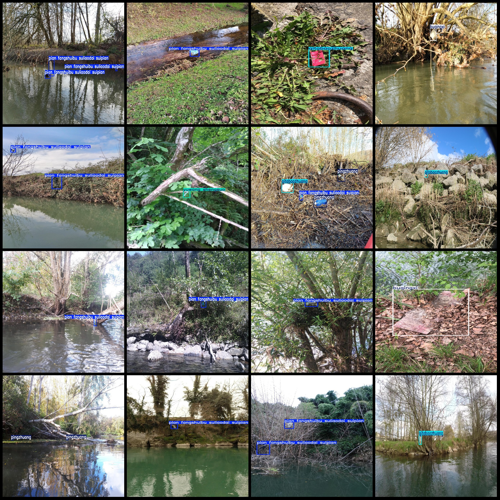
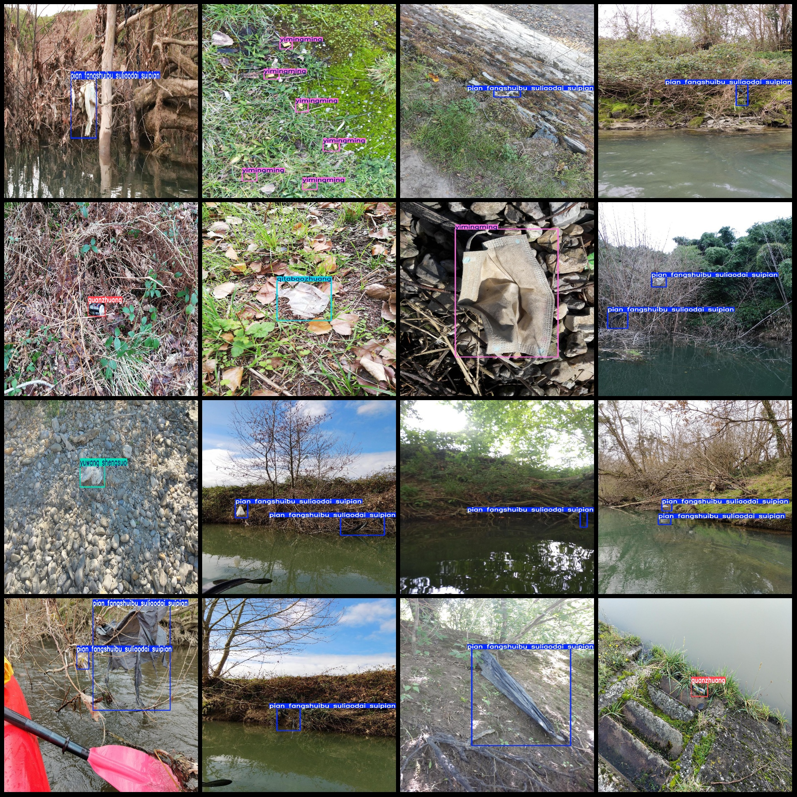

# Open Data for Outdoor Waste Detection with VOC+YOLO Format and 10 Categories

Dataset format: Pascal VOC format + YOLO format (txt files without split paths, only containing jpg images and corresponding VOC format xml files and YOLO format txt files)
Number of images (jpg file counts): 4278
Number of annotations (xml file counts): 4278
Number of annotations (txt file counts): 4278
Number of annotation categories: 10
Annotation category names (Note that the order in the YOLO format is not consistent with this, but according to the labels in the 'classes.txt' file): ["buqingxi", "guanzhuang", "juemiancailiao", "luntai", "pian fangshuibu suliaodai suipian", "pingzhuang", "qitabaozhuang", "tong", "yimingming", "yuwang"]
shengsuo"]  
The given text does not contain enough information to determine its category.
The number of boxes annotated in each category:
buqingxi box count = 591  

The number of boxes or frames in a frame structure is 184.

If you want to translate this into English, you might say:

The number of boxes or frames in a frame structure is 184.
juemiancailiao box count = 95  
The lintai frame count is 43.
pian fangshuibu suliaodai suipian box count = 3944  
pingzhuang box count = 1157  
qitabaozhuang box count = 512  
49

If we assume that 49 refers to a single unit (as in counting by one or ten), then it would be written as "49" or "149" in Chinese.

If 49 refers to a hundred, then it would be written as "four hundred nine" in Chinese.

If 49 refers to a thousand, then it would be written as "four hundred ninety" in Chinese.

Without knowing the specific context or unit of measurement, it is impossible to accurately translate the number 49 into English.
The number of frames is 228.
yuwang shengsuo box count = 126  
total boxes: 6929  
images per class:   
buqingxi images = 508  
guanzhuang images = 153  
Juemiancailiao is a Chinese social media platform that allows users to post images and videos. The number of images or videos posted by a user is determined by the amount of content they have uploaded. In this case, Juemiancailiao has 84 images or videos posted by its users.
luntai images = 34  
The number of pictures owned by Pian Fangshuibu is 2458.
pingzhuang images = 831  
qitabaozhuang images = 469  
tong images = 47  
yimingming images = 176  
yuwang shengsuo images = 100  
Image resolution: Multi-resolution images, such as 810x1080, 1440x1080, etc.
Using annotation tool: labelImg
Annotation rules: Draw a rectangle around the class.
Important note: The dataset does not have splits for training, validation, and test sets. Please split it accordingly.
This dataset does not guarantee the accuracy of the trained model or weight file.
Image preview:
## Images

Here is a pay link on Stripe ( https://buy.stripe.com/3cs8yP7sY87d0vu9AB ). Please contact me lonlonago@foxmail.com after funding $89, and I will send you a complete data files , thank you!

